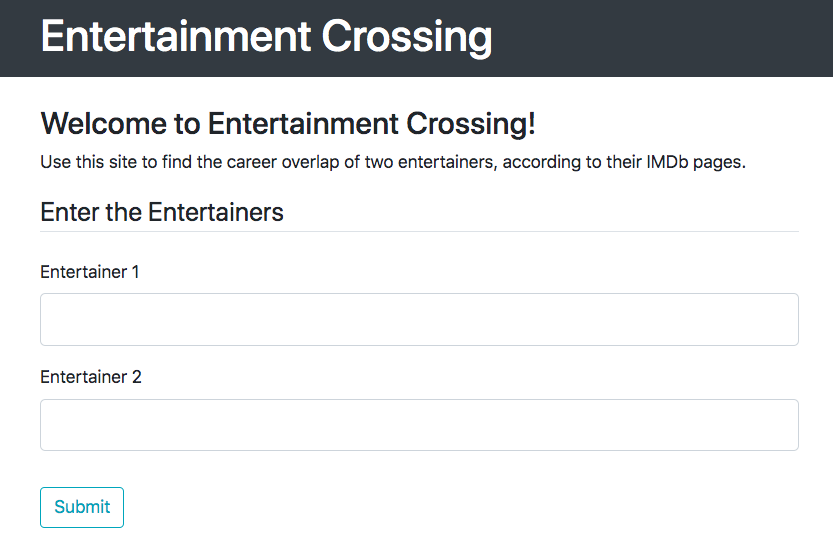
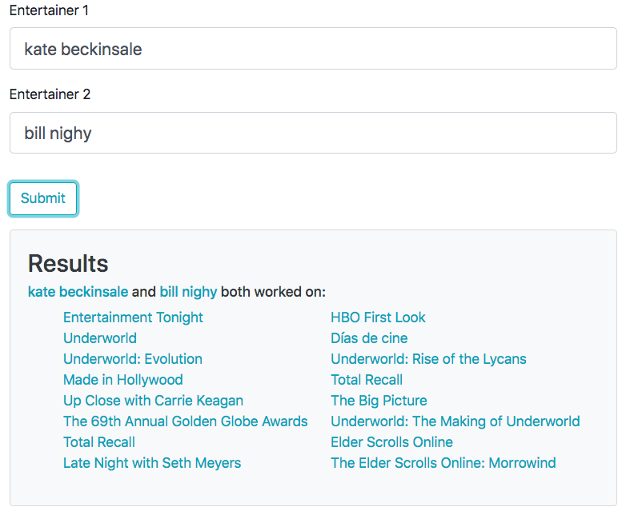

## Entertainment Crossing



Entertainment Crossing is a single page web app built using Flask, jQuery, the Python library Beautiful Soup, and Google's Search API. Use it to discover what projects entertainers have worked on together, according to their IMDb pages. 



### Running it locally

I use [docker](https://www.docker.com/products/docker-desktop) to build my site for deployment purposes. But locally, you can set up a [`virtual environment`](https://docs.python-guide.org/dev/virtualenvs/) to run the code. I recommend `virtualenv` which, once installed, can be added to the project via the terminal using 

```
$ cd entertainmentCrossing
$ virtualenv venv
```
_*NOTE* There is an `entertainmentCrossing` folder (package) *within* the `entertainmentCrossing` folder you cloned. This is a Flask-recommended set up. You want to be in the *outer* `entertainmentCrossing` folder for all commands instructed here._

Your `venv` can then be activated with `$ . ./venv/bin/activate`. You should now see `$ (venv)` at the front of your command line. Now you can install all of this project's requirements into your environment by running `$ pip3 install -r requirements.txt`. You should see packages being Collected and Downloaded as needed (to see which packages exactly, take a look at the `requirements.txt` file found in the root directory of the project). 

Now, you have everything you need to run the project locally. Run `python3 run.py`, and your server should be ready to go! (You can ignore the warning, as we are not in production deployment.) Check out your localhost (you can copy-paste `http://127.0.0.1:5000/` from the terminal) in a browser and see how it looks! 

### Testing

I have installed [pytest](https://docs.pytest.org/en/latest/getting-started.html) for testing the backend, but for speed of deployment I have yet to write each test (don't do this it's bad, test your code). To run any Python tests you create, simply call `python3 -m pytest`. Eventually I will also install [Selenium](https://www.selenium.dev/) to test the jQuery. 

### Next Steps

In the future I plan to add to the site in various ways:

##### Coding practices

- Add robust testing
- Cache recent queries (those made by the user and those found by google, to avoid IMDb scraping even if the user put in a slightly different query looking for the same person)
- If the site actually gets used, I would like to remove the scraping of IMDb and instead create a cron job that downloads their database periodically, searching through that for the crossings instead of the site itself. This would speed up the site immensely but cost money to host, so would only be worthwhile down the line.

##### Functionality

- Have a toggle to compare if the entertainers' time on a project overlapped or not
- Enter more than two entertainers to compare
- Add a toggle to remove talk shows, awards shows, etc
- Add a date range to limit the search